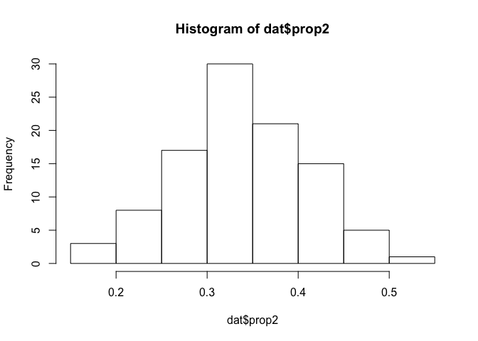
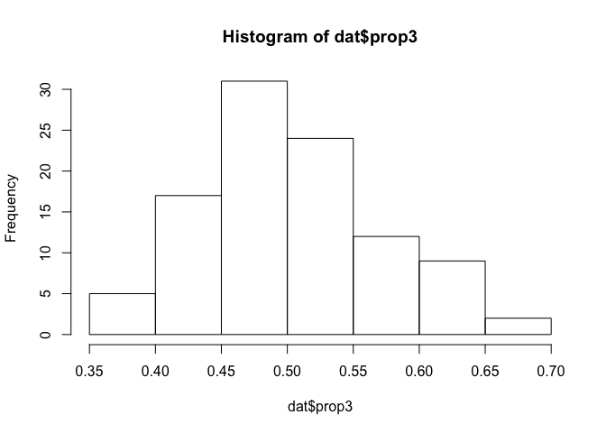

Why proportions?
----------------

The specific example I think about often is how to model the proportion
of fish catch attributed to a set of species. Of course this is far from
the only context where modeling proportions is important. Political
scientists often are tasked with modeling the share of votes for each
party, and marketing analysts frequently are asked about the factors
that affect the market share of particular brands.

For this example, however, I'm going to think of fish.

Simulate data
-------------

    rtrunc_norm <- function(n, mean, sd, lower = -Inf, upper = +Inf) {
      # This function defines a random sampling procedure for a truncated normal distribution.
      #
      samples <- vector(length = n)
      for (i in 1:n) {
        samples[i] <- rnorm(1, mean, sd)
        while (samples[i] < lower | samples[i] > upper) {
          samples[i] <- rnorm(1, mean, sd)
        }
      }
      return(samples)
    }

    N <- 100 # Think of this as fishing days.  Each day, some mix of fish is caught.
    y1 <- rtrunc_norm(N, 10, 5, lower = 0) # Pounds of fish 1
    y2 <- rtrunc_norm(N, 20, 5, lower = 0) # Pounds of fish 2
    y3 <- rtrunc_norm(N, 30, 5, lower = 0) # Pounds of fish 3

Now, lets calculate the proportion of the daily catch for each fish
type. And put it into a data set to be fit by Stan.

    prop1 <- y1 /(y1 + y2 + y3)
    prop2 <- y2 /(y1 + y2 + y3)
    prop3 <- y3 /(y1 + y2 + y3)

    dat <- list(N = N,
                y1 = y1,
                y2 = y2,
                y3 = y3,
                prop1 = prop1,
                prop2 = prop2,
                prop3 = prop3
                )

    hist(dat$prop1)

    hist(dat$prop2)

    hist(dat$prop3)

Dirichlet model
---------------

The code below specifies the Stan code for the Dirichlet model.

    data{
    int N;
    real prop1[N];
    real prop2[N];
    real prop3[N];
    }
    transformed data{
    real prop[N,3];
    for (i in 1:N) {
    prop[i,1] = prop1[i];
    prop[i,2] = prop2[i];
    prop[i,3] = prop3[i];
    }
    }
    parameters{
      vector<lower = 0>[3] alpha;
    }
    model{
    for (i in 1:N)
    target += dirichlet_lpdf(to_vector(prop[i,]) | alpha);
    }
    generated quantities{
    vector[3] post_prop;
    post_prop = dirichlet_rng(alpha); // Posterior predictive check.
    }

Okay, it's all set up. Let's fit the model

    dir_fit <- sampling(dir_model, data = dat)

Let's verify our model fit by plotting the alphas and posterior
predicted proportions.

    stan_dens(dir_fit)

This actually looks very good. The posterior predicted densities line up
very nicely with the historgrams of the data above.

Beta model
----------

For the next act, we'll fit the same data to three beta distribution
models. The beta distribution, can be thought of as a univariate
Dirichlet, used frequently for modeling single proportional
observations. Here, we'll use three of them because we have three
proportions.

The Stan code for the beta model is below. Note that unlike the
Dirichlet distribution, which is specified by a single parameter vector
alpha, each beta distribution takes two parameters an alpha and beta.

    data{
    int N;
    real prop1[N];
    real prop2[N];
    real prop3[N];
    }
    transformed data{
    real prop[N,3];
    for (i in 1:N) {
    prop[i,1] = prop1[i];
    prop[i,2] = prop2[i];
    prop[i,3] = prop3[i];
    }
    }
    parameters{
      vector<lower = 0>[3] alpha;
      vector<lower = 0>[3] beta;
    }
    model{
    for (i in 1:3)
    target += beta_lpdf(to_vector(prop[,i]) | alpha[i], beta[i]);
    }
    generated quantities{
    vector[3] post_prop;
    for (i in 1:3) {
    post_prop[i] = beta_rng(alpha[i], beta[i]); // Posterior predictive check.
    }
    }

    beta_fit <- sampling(beta_model, data = dat)

Let's take a look at the posterior estimates, and posterior predictions.

    stan_dens(beta_fit)

Although I sampled from three beta distributed parameters that modeled
proportional data that summed to 1, my posterior samples don't sum to 1.
Our model therefore doesn't yet accurately represent the data generating
process (Thanks to Gelman for introducing me to posterior predictive
checks). We can see this problem by running the following code.

    beta_fit_data <- as.data.frame(beta_fit)
    beta_fit_data$sum <- beta_fit_data$`post_prop[1]`+ beta_fit_data$`post_prop[2]`+ beta_fit_data$`post_prop[3]`
    head(beta_fit_data)

    ##   alpha[1]  alpha[2] alpha[3]  beta[1]  beta[2]  beta[3] post_prop[1]
    ## 1 2.781994 13.307176 21.06901 15.00838 27.19989 18.74804   0.21733239
    ## 2 3.270479  7.009020 22.37057 18.43411 14.16721 20.23250   0.07729578
    ## 3 3.602319  8.654243 20.35991 20.67085 17.49645 18.39628   0.19065400
    ## 4 2.979571 10.946947 24.65462 17.32615 21.73814 22.99128   0.14228384
    ## 5 2.902781 10.479494 20.54778 15.70327 21.10485 19.47617   0.29030482
    ## 6 3.647633  9.347550 21.40255 20.43391 19.46491 20.28458   0.02463127
    ##   post_prop[2] post_prop[3]     lp__       sum
    ## 1    0.2565130    0.5246429 350.5439 0.9984883
    ## 2    0.2792598    0.5230750 352.9548 0.8796306
    ## 3    0.3312390    0.4215802 354.2688 0.9434732
    ## 4    0.3215814    0.5217137 355.0184 0.9855790
    ## 5    0.3257766    0.4648300 355.2948 1.0809115
    ## 6    0.3541577    0.5031868 355.7612 0.8819758

We have to think more about how we can specify the model to address this
problem. One idea is to model the data as a simplex.

    data{
    int N;
    real prop1[N];
    real prop2[N];
    real prop3[N];
    }
    transformed data{
    simplex[3] prop[N];
    for (i in 1:N) {
    prop[i,1] = prop1[i];
    prop[i,2] = prop2[i];
    prop[i,3] = prop3[i];
    }
    }
    parameters{
      vector<lower = 0>[3] alpha;
      vector<lower = 0>[3] beta;
    }
    model{
    for (i in 1:3)
    target += beta_lpdf(to_vector(prop[,i]) | alpha[i], beta[i]);
    }
    generated quantities{
    vector[3] post_prop;
    for (i in 1:3) {
    post_prop[i] = beta_rng(alpha[i], beta[i]); // Posterior predictive check.
    }
    }

    beta_fit_simplex <- sampling(beta_model_simplex, data = dat)

    beta_fit_simplex_data <- as.data.frame(beta_fit_simplex)
    beta_fit_simplex_data$sum <- beta_fit_simplex_data$`post_prop[1]`+ beta_fit_simplex_data$`post_prop[2]`+ beta_fit_simplex_data$`post_prop[3]`
    head(beta_fit_simplex_data)

    ##   alpha[1] alpha[2] alpha[3]  beta[1]  beta[2]  beta[3] post_prop[1]
    ## 1 3.248651 9.439126 27.18143 17.87646 18.57757 25.55344   0.06652840
    ## 2 3.367361 9.706862 19.17760 19.07094 19.03485 17.63819   0.07818467
    ## 3 3.360980 9.243314 21.83130 18.26757 19.41844 19.90480   0.10498468
    ## 4 4.059637 8.941685 23.00925 23.37559 18.96512 20.58302   0.11743073
    ## 5 3.364809 8.537479 21.01345 18.59474 17.05523 20.04046   0.27391277
    ## 6 3.346667 9.523091 24.64135 17.20395 18.99333 23.88400   0.36277564
    ##   post_prop[2] post_prop[3]     lp__       sum
    ## 1    0.2286433    0.4841150 355.2701 0.7792867
    ## 2    0.3263379    0.5041384 354.5802 0.9086610
    ## 3    0.1972133    0.5882071 355.4847 0.8904051
    ## 4    0.2632228    0.5827149 352.7902 0.9633684
    ## 5    0.2658924    0.3683913 355.5379 0.9081965
    ## 6    0.3388608    0.4437614 354.7788 1.1453979

Nope, that didn't work. However, because we know the data is a simplex,
that means we only need to model p-1 parameters. If we define a beta
distribution for the first and second, the third is given. This means we
only need to sample two parameters, and the third will be what's left
over, ensuring our posterior predictions sum to 1.

    data{
    int N;
    real prop1[N];
    real prop2[N];
    }
    transformed data{
    real prop[N,2];
    for (i in 1:N) {
    prop[i,1] = prop1[i];
    prop[i,2] = prop2[i];
    }
    }
    parameters{
      vector<lower = 0>[2] alpha;
      vector<lower = 0>[2] beta;
    }
    model{
    for (i in 1:2)
    target += beta_lpdf(to_vector(prop[,i]) | alpha[i], beta[i]);
    }
    generated quantities{
    vector[2] post_prop;
    for (i in 1:2) {
    post_prop[i] = beta_rng(alpha[i], beta[i]); // Posterior predictive check.
    }
    }

    beta_fit_2 <- sampling(beta_model_2, data = dat)
    beta_fit_2_data <- as.data.frame(beta_fit_2)
    beta_fit_2_data$p3 <- 1 - (beta_fit_2_data$`post_prop[1]`+ beta_fit_2_data$`post_prop[2]`)
    beta_fit_2_data$sum <- beta_fit_2_data$p3+beta_fit_2_data$`post_prop[1]`+ beta_fit_2_data$`post_prop[2]`
    head(beta_fit_2_data)

Beta models with predictors
---------------------------

What if we observed predictors of our proportional observations? Greg
Snow introduced a reparameterization needed for a beta regression.
*α* = *μ* × *ϕ*, and *β* = (1 − *μ*)×*ϕ*. Then, you just predict *μ*
using your predictors, making sure to constrain it to be greater than 0.

We'll need to first simulate some additional data for the predictors.
Let's assume the predictor *x*, is positively related to proportion of
output 1.

    x <- 1.5 * y1
    dat_x <- list(N = N,
                x = x,
                y1 = y1,
                y2 = y2,
                y3 = y3,
                prop1 = prop1,
                prop2 = prop2,
                prop3 = prop3
                )

Now, the new reparameterized Stan model.

    data{
    int N;
    real prop1[N];
    real prop2[N];
    real x[N];
    }
    transformed data{
    real prop[N,2];
    for (i in 1:N) {
    prop[i,1] = prop1[i];
    prop[i,2] = prop2[i];
    }
    }
    parameters{
      real<lower = 0> alpha2;
      real<lower = 0> beta2;
      real<lower = 0> phi;
      real<lower = 0> mu;
      real<lower = 0> b;
    }
    transformed parameters{
      real<lower = 0> alpha1;
      real<lower = 0> beta1;
      alpha1 = mu * phi;
      beta1 = (1 - mu) * phi;
    }
    model{
    for (i in 1:N) {
      target += exponential_lpdf(mu | b * x[i]);
      target += beta_lpdf(prop[i,1] | alpha1, beta1);
      target += beta_lpdf(prop[i,2] | alpha2, beta2);
    }
    }
    generated quantities{
    vector[2] post_prop;
    post_prop[1] = beta_rng(alpha1, beta1); // Posterior predictive check.
    post_prop[2] = beta_rng(alpha2, beta2);
    }

    beta_fit_x <- sampling(beta_model_x, data = dat_x)

    ## 
    ## SAMPLING FOR MODEL 'e1e3f8c375b7a6937bba9924175cf096' NOW (CHAIN 1).
    ## Rejecting initial value:
    ##   Error evaluating the log probability at the initial value.
    ## validate transformed params: beta1 is -0.323445, but must be greater than or equal to 0
    ## 
    ## Gradient evaluation took 0.000183 seconds
    ## 1000 transitions using 10 leapfrog steps per transition would take 1.83 seconds.
    ## Adjust your expectations accordingly!
    ## 
    ## 
    ## Iteration:    1 / 2000 [  0%]  (Warmup)
    ## Iteration:  200 / 2000 [ 10%]  (Warmup)
    ## Iteration:  400 / 2000 [ 20%]  (Warmup)
    ## Iteration:  600 / 2000 [ 30%]  (Warmup)
    ## Iteration:  800 / 2000 [ 40%]  (Warmup)
    ## Iteration: 1000 / 2000 [ 50%]  (Warmup)
    ## Iteration: 1001 / 2000 [ 50%]  (Sampling)
    ## Iteration: 1200 / 2000 [ 60%]  (Sampling)
    ## Iteration: 1400 / 2000 [ 70%]  (Sampling)
    ## Iteration: 1600 / 2000 [ 80%]  (Sampling)
    ## Iteration: 1800 / 2000 [ 90%]  (Sampling)
    ## Iteration: 2000 / 2000 [100%]  (Sampling)
    ## 
    ##  Elapsed Time: 6.14653 seconds (Warm-up)
    ##                6.83028 seconds (Sampling)
    ##                12.9768 seconds (Total)
    ## 
    ## 
    ## SAMPLING FOR MODEL 'e1e3f8c375b7a6937bba9924175cf096' NOW (CHAIN 2).
    ## 
    ## Gradient evaluation took 0.000286 seconds
    ## 1000 transitions using 10 leapfrog steps per transition would take 2.86 seconds.
    ## Adjust your expectations accordingly!
    ## 
    ## 
    ## Iteration:    1 / 2000 [  0%]  (Warmup)
    ## Iteration:  200 / 2000 [ 10%]  (Warmup)
    ## Iteration:  400 / 2000 [ 20%]  (Warmup)
    ## Iteration:  600 / 2000 [ 30%]  (Warmup)
    ## Iteration:  800 / 2000 [ 40%]  (Warmup)
    ## Iteration: 1000 / 2000 [ 50%]  (Warmup)
    ## Iteration: 1001 / 2000 [ 50%]  (Sampling)
    ## Iteration: 1200 / 2000 [ 60%]  (Sampling)
    ## Iteration: 1400 / 2000 [ 70%]  (Sampling)
    ## Iteration: 1600 / 2000 [ 80%]  (Sampling)
    ## Iteration: 1800 / 2000 [ 90%]  (Sampling)
    ## Iteration: 2000 / 2000 [100%]  (Sampling)
    ## 
    ##  Elapsed Time: 5.79839 seconds (Warm-up)
    ##                5.8128 seconds (Sampling)
    ##                11.6112 seconds (Total)
    ## 
    ## 
    ## SAMPLING FOR MODEL 'e1e3f8c375b7a6937bba9924175cf096' NOW (CHAIN 3).
    ## 
    ## Gradient evaluation took 0.000207 seconds
    ## 1000 transitions using 10 leapfrog steps per transition would take 2.07 seconds.
    ## Adjust your expectations accordingly!
    ## 
    ## 
    ## Iteration:    1 / 2000 [  0%]  (Warmup)
    ## Iteration:  200 / 2000 [ 10%]  (Warmup)
    ## Iteration:  400 / 2000 [ 20%]  (Warmup)
    ## Iteration:  600 / 2000 [ 30%]  (Warmup)
    ## Iteration:  800 / 2000 [ 40%]  (Warmup)
    ## Iteration: 1000 / 2000 [ 50%]  (Warmup)
    ## Iteration: 1001 / 2000 [ 50%]  (Sampling)
    ## Iteration: 1200 / 2000 [ 60%]  (Sampling)
    ## Iteration: 1400 / 2000 [ 70%]  (Sampling)
    ## Iteration: 1600 / 2000 [ 80%]  (Sampling)
    ## Iteration: 1800 / 2000 [ 90%]  (Sampling)
    ## Iteration: 2000 / 2000 [100%]  (Sampling)
    ## 
    ##  Elapsed Time: 6.16526 seconds (Warm-up)
    ##                6.22335 seconds (Sampling)
    ##                12.3886 seconds (Total)
    ## 
    ## 
    ## SAMPLING FOR MODEL 'e1e3f8c375b7a6937bba9924175cf096' NOW (CHAIN 4).
    ## 
    ## Gradient evaluation took 0.000188 seconds
    ## 1000 transitions using 10 leapfrog steps per transition would take 1.88 seconds.
    ## Adjust your expectations accordingly!
    ## 
    ## 
    ## Iteration:    1 / 2000 [  0%]  (Warmup)
    ## Iteration:  200 / 2000 [ 10%]  (Warmup)
    ## Iteration:  400 / 2000 [ 20%]  (Warmup)
    ## Iteration:  600 / 2000 [ 30%]  (Warmup)
    ## Iteration:  800 / 2000 [ 40%]  (Warmup)
    ## Iteration: 1000 / 2000 [ 50%]  (Warmup)
    ## Iteration: 1001 / 2000 [ 50%]  (Sampling)
    ## Iteration: 1200 / 2000 [ 60%]  (Sampling)
    ## Iteration: 1400 / 2000 [ 70%]  (Sampling)
    ## Iteration: 1600 / 2000 [ 80%]  (Sampling)
    ## Iteration: 1800 / 2000 [ 90%]  (Sampling)
    ## Iteration: 2000 / 2000 [100%]  (Sampling)
    ## 
    ##  Elapsed Time: 6.41132 seconds (Warm-up)
    ##                6.20739 seconds (Sampling)
    ##                12.6187 seconds (Total)

    print(beta_fit_x)

    ## Inference for Stan model: e1e3f8c375b7a6937bba9924175cf096.
    ## 4 chains, each with iter=2000; warmup=1000; thin=1; 
    ## post-warmup draws per chain=1000, total post-warmup draws=4000.
    ## 
    ##                mean se_mean   sd   2.5%    25%    50%    75%  97.5% n_eff
    ## alpha2         9.56    0.03 1.33   7.18   8.62   9.47  10.44  12.31  1779
    ## beta2         19.50    0.07 2.74  14.68  17.54  19.34  21.25  25.09  1767
    ## phi           19.82    0.06 2.94  14.56  17.74  19.64  21.67  26.21  2751
    ## mu             0.11    0.00 0.01   0.09   0.10   0.11   0.12   0.13  2169
    ## b              0.66    0.00 0.09   0.51   0.60   0.65   0.71   0.85  2452
    ## alpha1         2.20    0.01 0.43   1.43   1.90   2.17   2.48   3.12  2282
    ## beta1         17.63    0.05 2.54  13.06  15.84  17.44  19.18  23.13  2868
    ## post_prop[1]   0.11    0.00 0.07   0.01   0.06   0.10   0.15   0.28  3976
    ## post_prop[2]   0.33    0.00 0.09   0.17   0.27   0.33   0.39   0.52  4000
    ## lp__         311.20    0.04 1.61 307.16 310.40 311.54 312.38 313.31  1872
    ##              Rhat
    ## alpha2          1
    ## beta2           1
    ## phi             1
    ## mu              1
    ## b               1
    ## alpha1          1
    ## beta1           1
    ## post_prop[1]    1
    ## post_prop[2]    1
    ## lp__            1
    ## 
    ## Samples were drawn using NUTS(diag_e) at Wed Oct 18 12:23:38 2017.
    ## For each parameter, n_eff is a crude measure of effective sample size,
    ## and Rhat is the potential scale reduction factor on split chains (at 
    ## convergence, Rhat=1).

    stan_dens(beta_fit_x)

