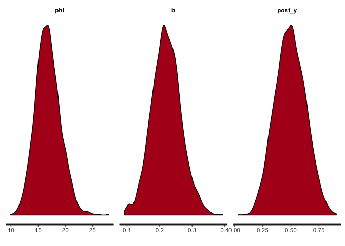
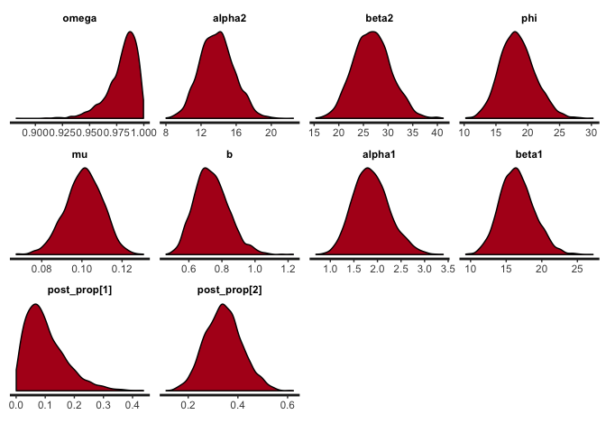

Why proportions?
----------------

The specific example I think about often is how to model the proportion of fish catch attributed to a set of species. Of course this is far from the only context where modeling proportions is important. Political scientists often are tasked with modeling the share of votes for each party, and marketing analysts frequently are asked about the factors that affect the market share of particular brands.

For this example, however, I'm going to think of fish.

Simulate data
-------------

``` r
rtrunc_norm <- function(n, mean, sd, lower = -Inf, upper = +Inf) {
  # This function defines a random sampling procedure for a truncated normal distribution.
  #
  samples <- vector(length = n)
  for (i in 1:n) {
    samples[i] <- rnorm(1, mean, sd)
    while (samples[i] < lower | samples[i] > upper) {
      samples[i] <- rnorm(1, mean, sd)
    }
  }
  return(samples)
}

N <- 100 # Think of this as fishing days.  Each day, some mix of fish is caught.
y1 <- rtrunc_norm(N, 10, 5, lower = 0) # Pounds of fish 1
y2 <- rtrunc_norm(N, 20, 5, lower = 0) # Pounds of fish 2
y3 <- rtrunc_norm(N, 30, 5, lower = 0) # Pounds of fish 3
```

Now, lets calculate the proportion of the daily catch for each fish type. And put it into a data set to be fit by Stan.

``` r
prop1 <- y1 /(y1 + y2 + y3)
prop2 <- y2 /(y1 + y2 + y3)
prop3 <- y3 /(y1 + y2 + y3)

dat <- list(N = N,
            y1 = y1,
            y2 = y2,
            y3 = y3,
            prop1 = prop1,
            prop2 = prop2,
            prop3 = prop3
            )

hist(dat$prop1)
```


``` r
hist(dat$prop2)
```


``` r
hist(dat$prop3)
```


Dirichlet model
---------------

The code below specifies the Stan code for the Dirichlet model.

``` stan
data{
int N;
real prop1[N];
real prop2[N];
real prop3[N];
}
transformed data{
real prop[N,3];
for (i in 1:N) {
prop[i,1] = prop1[i];
prop[i,2] = prop2[i];
prop[i,3] = prop3[i];
}
}
parameters{
  vector<lower = 0>[3] alpha;
}
model{
for (i in 1:N)
target += dirichlet_lpdf(to_vector(prop[i,]) | alpha);
}
generated quantities{
vector[3] post_prop;
post_prop = dirichlet_rng(alpha); // Posterior predictive check.
}
```

Okay, it's all set up. Let's fit the model

``` r
dir_fit <- sampling(dir_model, data = dat)
```

Let's verify our model fit by plotting the alphas and posterior predicted proportions.

``` r
stan_dens(dir_fit)
```

 This actually looks very good. The posterior predicted densities line up very nicely with the historgrams of the data above.

Beta model
----------

For the next act, we'll fit the same data to three beta distribution models. The beta distribution, can be thought of as a univariate Dirichlet, used frequently for modeling single proportional observations. Here, we'll use three of them because we have three proportions.

The Stan code for the beta model is below. Note that unlike the Dirichlet distribution, which is specified by a single parameter vector alpha, each beta distribution takes two parameters an alpha and beta.

``` stan
data{
int N;
real prop1[N];
real prop2[N];
real prop3[N];
}
transformed data{
real prop[N,3];
for (i in 1:N) {
prop[i,1] = prop1[i];
prop[i,2] = prop2[i];
prop[i,3] = prop3[i];
}
}
parameters{
  vector<lower = 0>[3] alpha;
  vector<lower = 0>[3] beta;
}
model{
for (i in 1:3)
target += beta_lpdf(to_vector(prop[,i]) | alpha[i], beta[i]);
}
generated quantities{
vector[3] post_prop;
for (i in 1:3) {
post_prop[i] = beta_rng(alpha[i], beta[i]); // Posterior predictive check.
}
}
```

``` r
beta_fit <- sampling(beta_model, data = dat)
```

Let's take a look at the posterior estimates, and posterior predictions.

``` r
stan_dens(beta_fit)
```


Although I sampled from three beta distributed parameters that modeled proportional data that summed to 1, my posterior samples don't sum to 1. Our model therefore doesn't yet accurately represent the data generating process (Thanks to Gelman for introducing me to posterior predictive checks). We can see this problem by running the following code.

``` r
beta_fit_data <- as.data.frame(beta_fit)
beta_fit_data$sum <- beta_fit_data$`post_prop[1]`+ beta_fit_data$`post_prop[2]`+ beta_fit_data$`post_prop[3]`
head(beta_fit_data)
```

    ##   alpha[1] alpha[2] alpha[3]  beta[1]  beta[2]  beta[3] post_prop[1]
    ## 1 3.686227 14.28663 23.93269 22.87811 28.45204 22.71477   0.07370162
    ## 2 2.805610 12.81449 27.47124 15.00407 24.14009 26.10163   0.26901928
    ## 3 2.756624 12.89066 26.52965 16.50938 25.44693 25.81707   0.19769670
    ## 4 2.900504 13.49170 27.59737 16.50684 25.34911 25.30698   0.04379937
    ## 5 2.781708 13.05583 26.98126 17.30732 25.18512 26.04744   0.10583292
    ## 6 2.758700 13.29018 22.77536 14.74971 25.33045 21.83547   0.22502441
    ##   post_prop[2] post_prop[3]     lp__       sum
    ## 1    0.3579896    0.4086897 372.2950 0.8403809
    ## 2    0.2737691    0.5406048 373.1145 1.0833932
    ## 3    0.2900235    0.5607954 373.9838 1.0485156
    ## 4    0.3135446    0.5214722 372.7401 0.8788161
    ## 5    0.3464666    0.5471145 373.6400 0.9994140
    ## 6    0.3354316    0.5928963 373.8378 1.1533523

We have to think more about how we can specify the model to address this problem. One idea is to model the data as a simplex.

``` stan
data{
int N;
real prop1[N];
real prop2[N];
real prop3[N];
}
transformed data{
simplex[3] prop[N];
for (i in 1:N) {
prop[i,1] = prop1[i];
prop[i,2] = prop2[i];
prop[i,3] = prop3[i];
}
}
parameters{
  vector<lower = 0>[3] alpha;
  vector<lower = 0>[3] beta;
}
model{
for (i in 1:3)
target += beta_lpdf(to_vector(prop[,i]) | alpha[i], beta[i]);
}
generated quantities{
vector[3] post_prop;
for (i in 1:3) {
post_prop[i] = beta_rng(alpha[i], beta[i]); // Posterior predictive check.
}
}
```

``` r
beta_fit_simplex <- sampling(beta_model_simplex, data = dat)
```

``` r
beta_fit_simplex_data <- as.data.frame(beta_fit_simplex)
beta_fit_simplex_data$sum <- beta_fit_simplex_data$`post_prop[1]`+ beta_fit_simplex_data$`post_prop[2]`+ beta_fit_simplex_data$`post_prop[3]`
head(beta_fit_simplex_data)
```

    ##   alpha[1] alpha[2] alpha[3]  beta[1]  beta[2]  beta[3] post_prop[1]
    ## 1 2.392360 13.44488 21.89301 15.92764 25.51617 20.86260   0.02645556
    ## 2 3.093494 12.14473 22.56440 15.84952 23.54645 22.09114   0.26927369
    ## 3 3.195788 10.00142 24.80488 19.94809 19.23144 23.39682   0.05536782
    ## 4 3.098470 15.80180 21.50509 16.75784 31.16780 21.10179   0.06615303
    ## 5 3.059734 15.06887 21.61852 20.70717 29.94420 20.82186   0.23059477
    ## 6 3.372046 13.67097 23.69533 17.06772 27.00988 21.95770   0.30212124
    ##   post_prop[2] post_prop[3]     lp__       sum
    ## 1    0.3492214    0.5507441 370.8932 0.9264211
    ## 2    0.3216912    0.5376146 372.4458 1.1285795
    ## 3    0.2820828    0.4525563 370.8560 0.7900069
    ## 4    0.3664421    0.4847681 373.4955 0.9173632
    ## 5    0.4265650    0.4459182 370.4425 1.1030780
    ## 6    0.1859899    0.3483127 371.5091 0.8364238

Nope, that didn't work. However, because we know the data is a simplex, that means we only need to model p-1 parameters. If we define a beta distribution for the first and second, the third is given. This means we only need to sample two parameters, and the third will be what's left over, ensuring our posterior predictions sum to 1.

``` stan
data{
int N;
real prop1[N];
real prop2[N];
}
transformed data{
real prop[N,2];
for (i in 1:N) {
prop[i,1] = prop1[i];
prop[i,2] = prop2[i];
}
}
parameters{
  vector<lower = 0>[2] alpha;
  vector<lower = 0>[2] beta;
}
model{
for (i in 1:2)
target += beta_lpdf(to_vector(prop[,i]) | alpha[i], beta[i]);
}
generated quantities{
vector[2] post_prop;
for (i in 1:2) {
post_prop[i] = beta_rng(alpha[i], beta[i]); // Posterior predictive check.
}
}
```

``` r
beta_fit_2 <- sampling(beta_model_2, data = dat)
beta_fit_2_data <- as.data.frame(beta_fit_2)
beta_fit_2_data$p3 <- 1 - (beta_fit_2_data$`post_prop[1]`+ beta_fit_2_data$`post_prop[2]`)
beta_fit_2_data$sum <- beta_fit_2_data$p3+beta_fit_2_data$`post_prop[1]`+ beta_fit_2_data$`post_prop[2]`
head(beta_fit_2_data)
```

Beta models with predictors
---------------------------

What if we observed predictors of our proportional observations? Greg Snow introduced a reparameterization needed for a beta regression. *α* = *μ* × *ϕ*, and *β* = (1 − *μ*)×*ϕ*. Then, you just predict *μ* using your predictors, making sure to constrain it to be greater than 0.

We'll need to first simulate some additional data for the predictors. Let's assume the predictor *x*, is positively related to proportion of output 1.

``` r
x <- 1.5 * y1
dat_x <- list(N = N,
            x = x,
            y1 = y1,
            y2 = y2,
            y3 = y3,
            prop1 = prop1,
            prop2 = prop2,
            prop3 = prop3
            )
```

Now, the new reparameterized Stan model.

``` stan
data{
int N;
real prop1[N];
real prop2[N];
real x[N];
}
transformed data{
real prop[N,2];
for (i in 1:N) {
prop[i,1] = prop1[i];
prop[i,2] = prop2[i];
}
}
parameters{
  real<lower = 0> alpha2;
  real<lower = 0> beta2;
  real<lower = 0> phi;
  real<lower = 0> mu;
  real<lower = 0> b;
}
transformed parameters{
  real<lower = 0> alpha1;
  real<lower = 0> beta1;
  alpha1 = mu * phi;
  beta1 = (1 - mu) * phi;
}
model{
for (i in 1:N) {
  target += exponential_lpdf(mu | b * x[i]);
  target += beta_lpdf(prop[i,1] | alpha1, beta1);
  target += beta_lpdf(prop[i,2] | alpha2, beta2);
}
}
generated quantities{
vector[2] post_prop;
post_prop[1] = beta_rng(alpha1, beta1); // Posterior predictive check.
post_prop[2] = beta_rng(alpha2, beta2);
}
```

``` r
beta_fit_x <- sampling(beta_model_x, data = dat_x)
```

``` r
print(beta_fit_x)
```

    ## Inference for Stan model: e1e3f8c375b7a6937bba9924175cf096.
    ## 4 chains, each with iter=2000; warmup=1000; thin=1; 
    ## post-warmup draws per chain=1000, total post-warmup draws=4000.
    ## 
    ##                mean se_mean   sd   2.5%    25%    50%    75%  97.5% n_eff
    ## alpha2        14.01    0.05 1.95  10.49  12.65  13.92  15.27  18.11  1597
    ## beta2         27.16    0.09 3.80  20.26  24.52  26.99  29.56  35.25  1610
    ## phi           18.76    0.06 2.69  13.89  16.83  18.65  20.57  24.17  2321
    ## mu             0.10    0.00 0.01   0.08   0.10   0.10   0.11   0.12  1807
    ## b              0.73    0.00 0.10   0.56   0.66   0.72   0.79   0.96  1724
    ## alpha1         1.92    0.01 0.38   1.22   1.65   1.90   2.18   2.70  1874
    ## beta1         16.83    0.05 2.34  12.58  15.19  16.73  18.42  21.53  2433
    ## post_prop[1]   0.10    0.00 0.07   0.01   0.05   0.09   0.14   0.28  3942
    ## post_prop[2]   0.34    0.00 0.07   0.20   0.29   0.34   0.39   0.49  3034
    ## lp__         330.96    0.04 1.60 326.92 330.17 331.31 332.11 333.07  1339
    ##              Rhat
    ## alpha2          1
    ## beta2           1
    ## phi             1
    ## mu              1
    ## b               1
    ## alpha1          1
    ## beta1           1
    ## post_prop[1]    1
    ## post_prop[2]    1
    ## lp__            1
    ## 
    ## Samples were drawn using NUTS(diag_e) at Wed Oct 18 14:36:56 2017.
    ## For each parameter, n_eff is a crude measure of effective sample size,
    ## and Rhat is the potential scale reduction factor on split chains (at 
    ## convergence, Rhat=1).

``` r
stan_dens(beta_fit_x)
```



Zero-inflated Beta regression
-----------------------------

Turns out Stan doesn't like 0's in the beta distribution, as the log probability evaluates to negative infinity. To handle O's in our data, we need to model them seperately as a bernoulli.

Below, we force our data to have a zero.

``` r
prop1[100] <- 0
dat_mixture <- list(N = N,
            x = x,
            y1 = y1,
            y2 = y2,
            y3 = y3,
            prop1 = prop1,
            prop2 = prop2,
            prop3 = prop3
            )
```

Now we'll redefine our Stan model to include the Bernoulli addition.

``` stan
data{
int N;
real prop1[N];
real prop2[N];
real x[N];
}
transformed data{
real prop[N,2];
for (i in 1:N) {
prop[i,1] = prop1[i];
prop[i,2] = prop2[i];
}
}
parameters{
  real<lower = 0, upper = 1> omega; // Bernoulli zero-inflation parameter.
  real<lower = 0> alpha2;
  real<lower = 0> beta2;
  real<lower = 0> phi;
  real<lower = 0> mu;
  real<lower = 0> b;
}
transformed parameters{
  real<lower = 0> alpha1;
  real<lower = 0> beta1;
  alpha1 = mu * phi;
  beta1 = (1 - mu) * phi;
}
model{
for (i in 1:N) {
if (prop[i,1] == 0) {
  target += bernoulli_lpmf(0 | omega);
}
else{
  target += bernoulli_lpmf(1 | omega);
  target += exponential_lpdf(mu | b * x[i]);
  target += beta_lpdf(prop[i,1] | alpha1, beta1);
  target += beta_lpdf(prop[i,2] | alpha2, beta2);
}
}
}
generated quantities{
vector[2] post_prop;
post_prop[1] = beta_rng(alpha1, beta1); // Posterior predictive check.
post_prop[2] = beta_rng(alpha2, beta2);
}
```

``` r
beta_fit_mixture <- sampling(beta_model_mixture, data = dat_mixture)
```

``` r
print(beta_fit_mixture)
```

    ## Inference for Stan model: 0c9dba1404091d8ddf91d2af8ba83988.
    ## 4 chains, each with iter=2000; warmup=1000; thin=1; 
    ## post-warmup draws per chain=1000, total post-warmup draws=4000.
    ## 
    ##                mean se_mean   sd   2.5%    25%    50%    75%  97.5% n_eff
    ## omega          0.98    0.00 0.01   0.95   0.97   0.98   0.99   1.00  3530
    ## alpha2        13.83    0.04 1.94  10.29  12.46  13.79  15.09  17.71  2101
    ## beta2         26.79    0.08 3.79  19.85  24.13  26.69  29.28  34.36  2136
    ## phi           18.42    0.05 2.74  13.44  16.49  18.25  20.13  24.14  2576
    ## mu             0.10    0.00 0.01   0.08   0.09   0.10   0.11   0.12  1998
    ## b              0.74    0.00 0.10   0.56   0.67   0.73   0.80   0.96  2005
    ## alpha1         1.87    0.01 0.39   1.19   1.60   1.85   2.12   2.70  1932
    ## beta1         16.54    0.05 2.39  12.24  14.88  16.41  18.03  21.47  2803
    ## post_prop[1]   0.10    0.00 0.07   0.01   0.05   0.09   0.14   0.27  4000
    ## post_prop[2]   0.34    0.00 0.07   0.21   0.29   0.34   0.39   0.50  3741
    ## lp__         316.50    0.04 1.76 312.28 315.55 316.83 317.79 318.96  1650
    ##              Rhat
    ## omega           1
    ## alpha2          1
    ## beta2           1
    ## phi             1
    ## mu              1
    ## b               1
    ## alpha1          1
    ## beta1           1
    ## post_prop[1]    1
    ## post_prop[2]    1
    ## lp__            1
    ## 
    ## Samples were drawn using NUTS(diag_e) at Wed Oct 18 14:38:45 2017.
    ## For each parameter, n_eff is a crude measure of effective sample size,
    ## and Rhat is the potential scale reduction factor on split chains (at 
    ## convergence, Rhat=1).

``` r
stan_dens(beta_fit_mixture)
```


