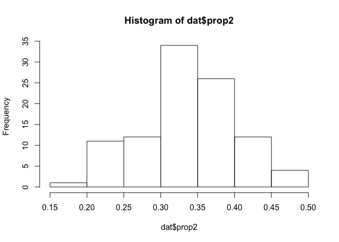
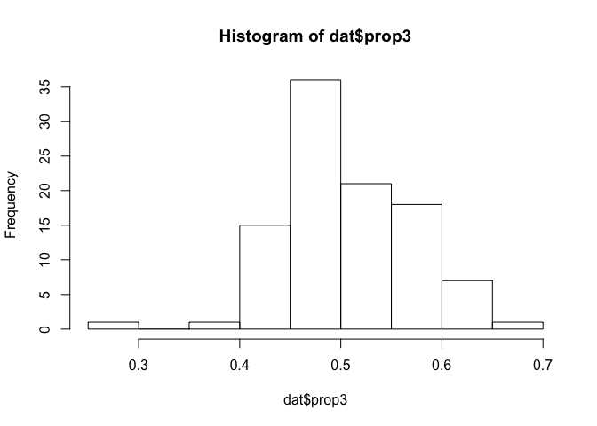

Why proportions?
----------------

The specific example I think about often is how to model the proportion of fish catch attributed to a set of species. Of course this is far from the only context where modeling proportions is important. Political scientists often are tasked with modeling the share of votes for each party, and marketing analysts frequently are asked about the factors that affect the market share of particular brands.

For this example, however, I'm going to think of fish.

Simulate data
-------------

``` r
rtrunc_norm <- function(n, mean, sd, lower = -Inf, upper = +Inf) {
  # This function defines a random sampling procedure for a truncated normal distribution.
  #
  samples <- vector(length = n)
  for (i in 1:n) {
    samples[i] <- rnorm(1, mean, sd)
    while (samples[i] < lower | samples[i] > upper) {
      samples[i] <- rnorm(1, mean, sd)
    }
  }
  return(samples)
}

N <- 100 # Think of this as fishing days.  Each day, some mix of fish is caught.
y1 <- rtrunc_norm(N, 10, 5, lower = 0) # Pounds of fish 1
y2 <- rtrunc_norm(N, 20, 5, lower = 0) # Pounds of fish 2
y3 <- rtrunc_norm(N, 30, 5, lower = 0) # Pounds of fish 3
```

Now, lets calculate the proportion of the daily catch for each fish type. And put it into a data set to be fit by Stan.

``` r
prop1 <- y1 /(y1 + y2 + y3)
prop2 <- y2 /(y1 + y2 + y3)
prop3 <- y3 /(y1 + y2 + y3)

dat <- list(N = N,
            y1 = y1,
            y2 = y2,
            y3 = y3,
            prop1 = prop1,
            prop2 = prop2,
            prop3 = prop3
            )

hist(dat$prop1)
```


``` r
hist(dat$prop2)
```



``` r
hist(dat$prop3)
```



Dirichlet model
---------------

The code below specifies the Stan code for the Dirichlet model.

``` stan
data{
int N;
real prop1[N];
real prop2[N];
real prop3[N];
}
transformed data{
real prop[N,3];
for (i in 1:N) {
prop[i,1] = prop1[i];
prop[i,2] = prop2[i];
prop[i,3] = prop3[i];
}
}
parameters{
  vector<lower = 0>[3] alpha;
}
model{
for (i in 1:N)
target += dirichlet_lpdf(to_vector(prop[i,]) | alpha);
}
generated quantities{
vector[3] post_prop;
post_prop = dirichlet_rng(alpha); // Posterior predictive check.
}
```

Okay, it's all set up. Let's fit the model

``` r
dir_fit <- sampling(dir_model, data = dat)
```

Let's verify our model fit by plotting the alphas and posterior predicted proportions.

``` r
stan_dens(dir_fit)
```

 This actually looks very good. The posterior predicted densities line up very nicely with the historgrams of the data above.

Beta model
----------

For the next act, we'll fit the same data to three beta distribution models. The beta distribution, can be thought of as a univariate Dirichlet, used frequently for modeling single proportional observations. Here, we'll use three of them because we have three proportions.

The Stan code for the beta model is below. Note that unlike the Dirichlet distribution, which is specified by a single parameter vector alpha, each beta distribution takes two parameters an alpha and beta.

``` stan
data{
int N;
real prop1[N];
real prop2[N];
real prop3[N];
}
transformed data{
real prop[N,3];
for (i in 1:N) {
prop[i,1] = prop1[i];
prop[i,2] = prop2[i];
prop[i,3] = prop3[i];
}
}
parameters{
  vector<lower = 0>[3] alpha;
  vector<lower = 0>[3] beta;
}
model{
for (i in 1:3)
target += beta_lpdf(to_vector(prop[,i]) | alpha[i], beta[i]);
}
generated quantities{
vector[3] post_prop;
for (i in 1:3) {
post_prop[i] = beta_rng(alpha[i], beta[i]); // Posterior predictive check.
}
}
```

``` r
beta_fit <- sampling(beta_model, data = dat)
```

Let's take a look at the posterior estimates, and posterior predictions.

``` r
stan_dens(beta_fit)
```


Although I sampled from three beta distributed parameters that modeled proportional data that summed to 1, my posterior samples don't sum to 1. Our model therefore doesn't yet accurately represent the data generating process (Thanks to Gelman for introducing me to posterior predictive checks). We can see this problem by running the following code.

``` r
beta_fit_data <- as.data.frame(beta_fit)
beta_fit_data$sum <- beta_fit_data$`post_prop[1]`+ beta_fit_data$`post_prop[2]`+ beta_fit_data$`post_prop[3]`
head(beta_fit_data)
```

    ##   alpha[1] alpha[2] alpha[3]  beta[1]  beta[2]  beta[3] post_prop[1]
    ## 1 6.976911 19.38307 22.05444 35.74443 40.38022 22.76318   0.07184450
    ## 2 6.395753 20.83099 24.16112 32.26256 41.84124 24.89541   0.19115218
    ## 3 8.127483 12.40731 29.37913 35.68489 25.41039 30.25857   0.08616504
    ## 4 7.069402 15.21709 24.23062 34.49364 30.38814 24.53504   0.17643562
    ## 5 6.142265 15.76343 22.71116 28.44262 29.54166 23.06247   0.12107980
    ## 6 9.353832 15.12979 28.42157 42.93246 30.19491 29.51343   0.09762679
    ##   post_prop[2] post_prop[3]     lp__       sum
    ## 1    0.2853191    0.5885699 406.7397 0.9457335
    ## 2    0.3029284    0.4687990 407.4410 0.9628796
    ## 3    0.2003129    0.4103938 407.2363 0.6968717
    ## 4    0.4532992    0.4964465 410.3372 1.1261813
    ## 5    0.3918609    0.4189066 406.8965 0.9318473
    ## 6    0.3580073    0.5586215 408.5053 1.0142556

We have to think more about how we can specify the model to address this problem. One idea is to model the data as a simplex.

``` stan
data{
int N;
real prop1[N];
real prop2[N];
real prop3[N];
}
transformed data{
simplex[3] prop[N];
for (i in 1:N) {
prop[i,1] = prop1[i];
prop[i,2] = prop2[i];
prop[i,3] = prop3[i];
}
}
parameters{
  vector<lower = 0>[3] alpha;
  vector<lower = 0>[3] beta;
}
model{
for (i in 1:3)
target += beta_lpdf(to_vector(prop[,i]) | alpha[i], beta[i]);
}
generated quantities{
vector[3] post_prop;
for (i in 1:3) {
post_prop[i] = beta_rng(alpha[i], beta[i]); // Posterior predictive check.
}
}
```

``` r
beta_fit_simplex <- sampling(beta_model_simplex, data = dat)
```

``` r
beta_fit_simplex_data <- as.data.frame(beta_fit_simplex)
beta_fit_simplex_data$sum <- beta_fit_simplex_data$`post_prop[1]`+ beta_fit_simplex_data$`post_prop[2]`+ beta_fit_simplex_data$`post_prop[3]`
head(beta_fit_simplex_data)
```

    ##   alpha[1] alpha[2] alpha[3]  beta[1]  beta[2]  beta[3] post_prop[1]
    ## 1 6.463574 13.49425 19.66597 28.34040 28.98190 20.34179   0.15350301
    ## 2 6.277564 10.62480 18.83519 27.27675 22.86267 18.85310   0.20363468
    ## 3 5.891929 10.46592 19.99842 27.78927 22.36508 20.08185   0.18523497
    ## 4 5.843367 11.43876 20.70803 26.75313 21.98316 20.74350   0.09978294
    ## 5 6.236242 11.22164 21.78641 29.95809 24.33773 21.78823   0.17175471
    ## 6 8.475050 18.76393 27.46420 40.96505 35.56680 28.60661   0.14787620
    ##   post_prop[2] post_prop[3]     lp__       sum
    ## 1    0.3868176    0.5192880 405.9125 1.0596086
    ## 2    0.3273703    0.5801336 401.4891 1.1111386
    ## 3    0.3808497    0.5056809 403.3795 1.0717656
    ## 4    0.2630641    0.5994266 404.3224 0.9622737
    ## 5    0.3080784    0.5302770 404.8635 1.0101101
    ## 6    0.3310511    0.4569854 406.6144 0.9359128

Nope, that didn't work. However, because we know the data is a simplex, that means we only need to model p-1 parameters. If we define a beta distribution for the first and second, the third is given. This means we only need to sample two parameters, and the third will be what's left over, ensuring our posterior predictions sum to 1.

``` stan
data{
int N;
real prop1[N];
real prop2[N];
}
transformed data{
real prop[N,2];
for (i in 1:N) {
prop[i,1] = prop1[i];
prop[i,2] = prop2[i];
}
}
parameters{
  vector<lower = 0>[2] alpha;
  vector<lower = 0>[2] beta;
}
model{
for (i in 1:2)
target += beta_lpdf(to_vector(prop[,i]) | alpha[i], beta[i]);
}
generated quantities{
vector[2] post_prop;
for (i in 1:2) {
post_prop[i] = beta_rng(alpha[i], beta[i]); // Posterior predictive check.
}
}
```

``` r
beta_fit_2 <- sampling(beta_model_2, data = dat)
beta_fit_2_data <- as.data.frame(beta_fit_2)
beta_fit_2_data$p3 <- 1 - (beta_fit_2_data$`post_prop[1]`+ beta_fit_2_data$`post_prop[2]`)
beta_fit_2_data$sum <- beta_fit_2_data$p3+beta_fit_2_data$`post_prop[1]`+ beta_fit_2_data$`post_prop[2]`
head(beta_fit_2_data)
```

Beta models with predictors
---------------------------

What if we observed predictors of our proportional observations? Greg Snow introduced a reparameterization needed for a beta regression. *α* = *μ* × *ϕ*, and *β* = (1 − *μ*)×*ϕ*. Then, you just predict *μ* using your predictors, making sure to constrain it to be greater than 0.

We'll need to first simulate some additional data for the predictors. Let's assume the predictor *x*, is positively related to proportion of output 1.

``` r
x <- 1.5 * y1
dat_x <- list(N = N,
            x = x,
            y1 = y1,
            y2 = y2,
            y3 = y3,
            prop1 = prop1,
            prop2 = prop2,
            prop3 = prop3
            )
```

Now, the new reparameterized Stan model.

``` stan
data{
int N;
real prop1[N];
real prop2[N];
real x[N];
}
transformed data{
real prop[N,2];
for (i in 1:N) {
prop[i,1] = prop1[i];
prop[i,2] = prop2[i];
}
}
parameters{
  real<lower = 0> alpha2;
  real<lower = 0> beta2;
  real<lower = 0> phi;
  real<lower = 0> mu;
  real<lower = 0> b;
}
transformed parameters{
  real<lower = 0> alpha1;
  real<lower = 0> beta1;
  alpha1 = mu * phi;
  beta1 = (1 - mu) * phi;
}
model{
for (i in 1:N) {
  target += exponential_lpdf(mu | b * x[i]);
  target += beta_lpdf(prop[i,1] | alpha1, beta1);
  target += beta_lpdf(prop[i,2] | alpha2, beta2);
}
}
generated quantities{
vector[2] post_prop;
post_prop[1] = beta_rng(alpha1, beta1); // Posterior predictive check.
post_prop[2] = beta_rng(alpha2, beta2);
}
```

``` r
beta_fit_x <- sampling(beta_model_x, data = dat_x)
```

``` r
print(beta_fit_x)
```

    ## Inference for Stan model: e1e3f8c375b7a6937bba9924175cf096.
    ## 4 chains, each with iter=2000; warmup=1000; thin=1; 
    ## post-warmup draws per chain=1000, total post-warmup draws=4000.
    ## 
    ##                mean se_mean   sd   2.5%    25%    50%    75%  97.5% n_eff
    ## alpha2        16.01    0.05 2.28  12.00  14.43  15.88  17.42  20.74  1935
    ## beta2         32.43    0.11 4.66  24.03  29.26  32.20  35.31  42.18  1932
    ## phi           38.89    0.10 5.52  28.75  35.12  38.56  42.41  50.70  2938
    ## mu             0.15    0.00 0.01   0.14   0.15   0.15   0.16   0.17  2929
    ## b              0.40    0.00 0.04   0.32   0.37   0.40   0.43   0.49  3052
    ## alpha1         6.01    0.02 0.95   4.27   5.35   5.95   6.61   8.02  2759
    ## beta1         32.88    0.08 4.60  24.39  29.77  32.60  35.82  42.77  2984
    ## post_prop[1]   0.15    0.00 0.06   0.06   0.11   0.15   0.19   0.28  4000
    ## post_prop[2]   0.33    0.00 0.07   0.20   0.28   0.33   0.37   0.47  4000
    ## lp__         346.10    0.04 1.64 341.95 345.27 346.45 347.31 348.27  1575
    ##              Rhat
    ## alpha2          1
    ## beta2           1
    ## phi             1
    ## mu              1
    ## b               1
    ## alpha1          1
    ## beta1           1
    ## post_prop[1]    1
    ## post_prop[2]    1
    ## lp__            1
    ## 
    ## Samples were drawn using NUTS(diag_e) at Wed Oct 18 14:25:47 2017.
    ## For each parameter, n_eff is a crude measure of effective sample size,
    ## and Rhat is the potential scale reduction factor on split chains (at 
    ## convergence, Rhat=1).

``` r
stan_dens(beta_fit_x)
```


Zero-inflated Beta regression
-----------------------------

Turns out Stan doesn't like 0's in the beta distribution, as the log probability evaluates to negative infinity. To handle O's in our data, we need to model them seperately as a bernoulli.

Below, we force our data to have a zero.

``` r
prop1[100] <- 0
dat_mixture <- list(N = N,
            x = x,
            y1 = y1,
            y2 = y2,
            y3 = y3,
            prop1 = prop1,
            prop2 = prop2,
            prop3 = prop3
            )
```

Now we'll redefine our Stan model to include the Bernoulli addition.

``` stan
data{
int N;
real prop1[N];
real prop2[N];
real x[N];
}
transformed data{
real prop[N,2];
for (i in 1:N) {
prop[i,1] = prop1[i];
prop[i,2] = prop2[i];
}
}
parameters{
  real<lower = 0, upper = 1> omega; // Bernoulli zero-inflation parameter.
  real<lower = 0> alpha2;
  real<lower = 0> beta2;
  real<lower = 0> phi;
  real<lower = 0> mu;
  real<lower = 0> b;
}
transformed parameters{
  real<lower = 0> alpha1;
  real<lower = 0> beta1;
  alpha1 = mu * phi;
  beta1 = (1 - mu) * phi;
}
model{
for (i in 1:N) {
if (prop[i,1] == 0) {
target += bernoulli_lpmf(0 | omega);
}
else{
  target += exponential_lpdf(mu | b * x[i]);
  target += beta_lpdf(prop[i,1] | alpha1, beta1);
  target += beta_lpdf(prop[i,2] | alpha2, beta2);
}
}
}
generated quantities{
vector[2] post_prop;
post_prop[1] = beta_rng(alpha1, beta1); // Posterior predictive check.
post_prop[2] = beta_rng(alpha2, beta2);
}
```

``` r
beta_fit_mixture <- sampling(beta_model_mixture, data = dat_mixture)
```

``` r
print(beta_fit_mixture)
```

    ## Inference for Stan model: d470823aa729614db9cf49edb7ba4b66.
    ## 4 chains, each with iter=2000; warmup=1000; thin=1; 
    ## post-warmup draws per chain=1000, total post-warmup draws=4000.
    ## 
    ##                mean se_mean   sd   2.5%    25%    50%    75%  97.5% n_eff
    ## omega          0.34    0.00 0.24   0.02   0.14   0.30   0.50   0.84  4000
    ## alpha2        16.03    0.05 2.20  12.06  14.52  15.92  17.48  20.67  1937
    ## beta2         32.37    0.10 4.45  24.36  29.27  32.14  35.29  41.86  1966
    ## phi           38.90    0.10 5.54  28.66  35.08  38.69  42.36  50.30  3211
    ## mu             0.15    0.00 0.01   0.14   0.15   0.15   0.16   0.17  2783
    ## b              0.40    0.00 0.04   0.32   0.37   0.40   0.43   0.50  3068
    ## alpha1         5.99    0.02 0.95   4.22   5.34   5.93   6.60   7.95  2885
    ## beta1         32.90    0.08 4.62  24.38  29.68  32.74  35.79  42.47  3292
    ## post_prop[1]   0.15    0.00 0.06   0.06   0.11   0.15   0.19   0.28  3827
    ## post_prop[2]   0.33    0.00 0.07   0.20   0.28   0.33   0.38   0.47  4000
    ## lp__         340.41    0.04 1.72 336.25 339.53 340.72 341.68 342.83  1471
    ##              Rhat
    ## omega           1
    ## alpha2          1
    ## beta2           1
    ## phi             1
    ## mu              1
    ## b               1
    ## alpha1          1
    ## beta1           1
    ## post_prop[1]    1
    ## post_prop[2]    1
    ## lp__            1
    ## 
    ## Samples were drawn using NUTS(diag_e) at Wed Oct 18 14:27:46 2017.
    ## For each parameter, n_eff is a crude measure of effective sample size,
    ## and Rhat is the potential scale reduction factor on split chains (at 
    ## convergence, Rhat=1).

``` r
stan_dens(beta_fit_mixture)
```


