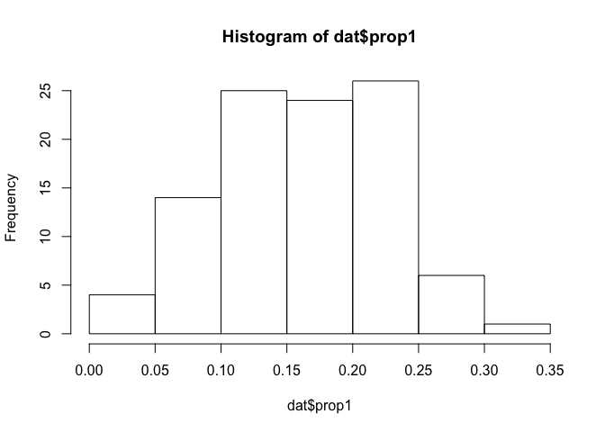
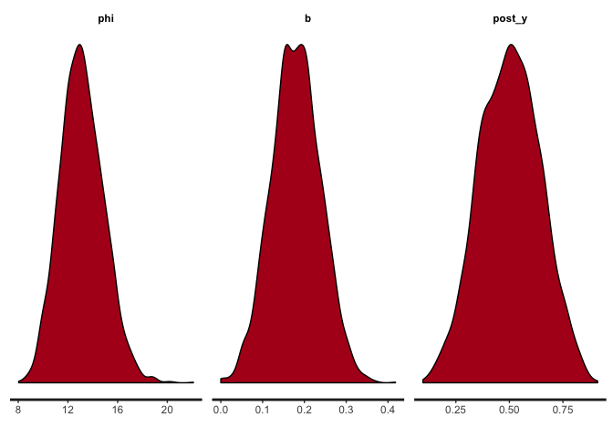

Why proportions?
----------------

The specific example I think about often is how to model the proportion of fish catch attributed to a set of species. Of course this is far from the only context where modeling proportions is important. Political scientists often are tasked with modeling the share of votes for each party, and marketing analysts frequently are asked about the factors that affect the market share of particular brands.

For this example, however, I'm going to think of fish.

Simulate data
-------------

``` r
rtrunc_norm <- function(n, mean, sd, lower = -Inf, upper = +Inf) {
  # This function defines a random sampling procedure for a truncated normal distribution.
  #
  samples <- vector(length = n)
  for (i in 1:n) {
    samples[i] <- rnorm(1, mean, sd)
    while (samples[i] < lower | samples[i] > upper) {
      samples[i] <- rnorm(1, mean, sd)
    }
  }
  return(samples)
}

N <- 100 # Think of this as fishing days.  Each day, some mix of fish is caught.
y1 <- rtrunc_norm(N, 10, 5, lower = 0) # Pounds of fish 1
y2 <- rtrunc_norm(N, 20, 5, lower = 0) # Pounds of fish 2
y3 <- rtrunc_norm(N, 30, 5, lower = 0) # Pounds of fish 3
```

Now, lets calculate the proportion of the daily catch for each fish type. And put it into a data set to be fit by Stan.

``` r
prop1 <- y1 /(y1 + y2 + y3)
prop2 <- y2 /(y1 + y2 + y3)
prop3 <- y3 /(y1 + y2 + y3)

dat <- list(N = N,
            y1 = y1,
            y2 = y2,
            y3 = y3,
            prop1 = prop1,
            prop2 = prop2,
            prop3 = prop3
            )

hist(dat$prop1)
```



``` r
hist(dat$prop2)
```


``` r
hist(dat$prop3)
```


Dirichlet model
---------------

The code below specifies the Stan code for the Dirichlet model.

``` stan
data{
int N;
real prop1[N];
real prop2[N];
real prop3[N];
}
transformed data{
real prop[N,3];
for (i in 1:N) {
prop[i,1] = prop1[i];
prop[i,2] = prop2[i];
prop[i,3] = prop3[i];
}
}
parameters{
  vector<lower = 0>[3] alpha;
}
model{
for (i in 1:N)
target += dirichlet_lpdf(to_vector(prop[i,]) | alpha);
}
generated quantities{
vector[3] post_prop;
post_prop = dirichlet_rng(alpha); // Posterior predictive check.
}
```

Okay, it's all set up. Let's fit the model

``` r
dir_fit <- sampling(dir_model, data = dat)
```

Let's verify our model fit by plotting the alphas and posterior predicted proportions.

``` r
stan_dens(dir_fit)
```

 This actually looks very good. The posterior predicted densities line up very nicely with the historgrams of the data above.

Beta model
----------

For the next act, we'll fit the same data to three beta distribution models. The beta distribution, can be thought of as a univariate Dirichlet, used frequently for modeling single proportional observations. Here, we'll use three of them because we have three proportions.

The Stan code for the beta model is below. Note that unlike the Dirichlet distribution, which is specified by a single parameter vector alpha, each beta distribution takes two parameters an alpha and beta.

``` stan
data{
int N;
real prop1[N];
real prop2[N];
real prop3[N];
}
transformed data{
real prop[N,3];
for (i in 1:N) {
prop[i,1] = prop1[i];
prop[i,2] = prop2[i];
prop[i,3] = prop3[i];
}
}
parameters{
  vector<lower = 0>[3] alpha;
  vector<lower = 0>[3] beta;
}
model{
for (i in 1:3)
target += beta_lpdf(to_vector(prop[,i]) | alpha[i], beta[i]);
}
generated quantities{
vector[3] post_prop;
for (i in 1:3) {
post_prop[i] = beta_rng(alpha[i], beta[i]); // Posterior predictive check.
}
}
```

``` r
beta_fit <- sampling(beta_model, data = dat)
```

Let's take a look at the posterior estimates, and posterior predictions.

``` r
stan_dens(beta_fit)
```


Although I sampled from three beta distributed parameters that modeled proportional data that summed to 1, my posterior samples don't sum to 1. Our model therefore doesn't yet accurately represent the data generating process (Thanks to Gelman for introducing me to posterior predictive checks). We can see this problem by running the following code.

``` r
beta_fit_data <- as.data.frame(beta_fit)
beta_fit_data$sum <- beta_fit_data$`post_prop[1]`+ beta_fit_data$`post_prop[2]`+ beta_fit_data$`post_prop[3]`
head(beta_fit_data)
```

    ##   alpha[1] alpha[2] alpha[3]  beta[1]  beta[2]  beta[3] post_prop[1]
    ## 1 3.798829 18.48414 33.17991 19.43308 35.00484 32.42173   0.08247914
    ## 2 3.934826 18.42558 34.99603 18.73384 37.30388 35.40368   0.16956299
    ## 3 4.390599 20.65171 32.33372 22.03611 40.17494 32.67169   0.13897228
    ## 4 3.962535 19.86257 32.00048 22.88909 37.56030 32.99652   0.10023730
    ## 5 3.952399 19.19756 32.09627 22.56175 38.15629 32.18776   0.19450924
    ## 6 3.230957 16.78664 27.20155 17.81236 32.96110 27.12761   0.07606352
    ##   post_prop[2] post_prop[3]     lp__       sum
    ## 1    0.3425882    0.5872201 400.9953 1.0122875
    ## 2    0.2982182    0.4021742 398.9554 0.8699554
    ## 3    0.3302484    0.4858804 400.6320 0.9551012
    ## 4    0.3999418    0.5322263 397.9385 1.0324054
    ## 5    0.2713257    0.5672881 401.1226 1.0331230
    ## 6    0.2535737    0.5185884 401.3282 0.8482256

However, because we know the data are a simplex, that means we only need to model p-1 parameters. If we define a beta distribution for the first and second, the third is given. This means we only need to sample two parameters, and the third will be what's left over, ensuring our posterior predictions sum to 1.

``` stan
data{
int N;
real prop1[N];
real prop2[N];
}
transformed data{
real prop[N,2];
for (i in 1:N) {
prop[i,1] = prop1[i];
prop[i,2] = prop2[i];
}
}
parameters{
  vector<lower = 0>[2] alpha;
  vector<lower = 0>[2] beta;
}
model{
for (i in 1:2)
target += beta_lpdf(to_vector(prop[,i]) | alpha[i], beta[i]);
}
generated quantities{
vector[2] post_prop;
for (i in 1:2) {
post_prop[i] = beta_rng(alpha[i], beta[i]); // Posterior predictive check.
}
}
```

``` r
beta_fit_2 <- sampling(beta_model_2, data = dat)
beta_fit_2_data <- as.data.frame(beta_fit_2)
beta_fit_2_data$p3 <- 1 - (beta_fit_2_data$`post_prop[1]`+ beta_fit_2_data$`post_prop[2]`)
beta_fit_2_data$sum <- beta_fit_2_data$p3+beta_fit_2_data$`post_prop[1]`+ beta_fit_2_data$`post_prop[2]`
head(beta_fit_2_data)
```

Beta models with predictors
---------------------------

What if we observed predictors of our proportional observations? Greg Snow introduced a reparameterization needed for a beta regression. *α* = *μ* × *ϕ*, and *β* = (1 − *μ*)×*ϕ*. Then, you just predict *μ* using your predictors, making sure to constrain it to be greater than 0.

We'll need to first simulate some additional data for the predictors. Let's assume the predictor *x*, is positively related to proportion of output 1.

``` r
N = 100
x = rnorm(N)
b = 0.2
mu = plogis(x * b)  # add noise if desired + rnorm(N, sd=.01)
phi = 15
A = mu*phi
B = (1-mu)*phi
y = rbeta(N, A, B)
dat_x <- list(N = N,
            x = x,
            y = y
            )
```

Now, the new reparameterized Stan model.

``` stan
data{
int N;
real y[N];
real x[N];
}
parameters{
  real<lower = 0> phi;
  real<lower = 0> b;
}
transformed parameters{
  real<lower = 0, upper = 1> mu[N];
  for (i in 1:N) {
  mu[i] = inv_logit(b * x[i]);
  }
}
model{
for (i in 1:N) {
  target += beta_lpdf(y[i] | mu[i] * phi, (1 - mu[i]) * phi);
}
}
generated quantities{
  real post_y;
  {
  real x_sim;
  real mu_sim;
  real alpha_sim;
  real beta_sim;
  x_sim = normal_rng(mean(x), sd(x));
  mu_sim = inv_logit(b * x_sim);
  alpha_sim = mu_sim * phi;
  beta_sim = (1 - mu_sim) * phi;
  post_y = beta_rng(alpha_sim, beta_sim);
  }
}
```

``` r
beta_fit_x <- sampling(beta_model_x, data = dat_x)
```

``` r
print(beta_fit_x, pars = c("phi", "b","post_y"))
```

    ## Inference for Stan model: c6f383a2a2bc11d95527f71a2102ceb6.
    ## 4 chains, each with iter=2000; warmup=1000; thin=1; 
    ## post-warmup draws per chain=1000, total post-warmup draws=4000.
    ## 
    ##         mean se_mean   sd 2.5%   25%   50%   75% 97.5% n_eff Rhat
    ## phi    13.14    0.04 1.75 9.94 11.93 13.05 14.29 16.78  1839    1
    ## b       0.18    0.00 0.06 0.07  0.14  0.18  0.22  0.30  1670    1
    ## post_y  0.50    0.00 0.14 0.23  0.40  0.50  0.60  0.78  4000    1
    ## 
    ## Samples were drawn using NUTS(diag_e) at Sat Oct 21 10:23:48 2017.
    ## For each parameter, n_eff is a crude measure of effective sample size,
    ## and Rhat is the potential scale reduction factor on split chains (at 
    ## convergence, Rhat=1).

``` r
stan_dens(beta_fit_x, pars = c("phi", "b","post_y"))
```



Zero-inflated Beta regression
-----------------------------

Turns out Stan doesn't like 0's in the beta distribution, as the log probability evaluates to negative infinity. To handle O's in our data, we need to model them seperately as a Bernoulli.

Below, we force our data to have a zero.

``` r
dat_mixture = dat_x
dat_mixture$y[[1]] = 0
```

Now we'll redefine our Stan model to include the Bernoulli addition.

``` stan
data{
int N;
real y[N];
real x[N];
}
parameters{
  real<lower = 0> phi;
  real<lower = 0> b;
  real<lower = 0, upper = 1> theta;
}
transformed parameters{
  real<lower = 0, upper = 1> mu[N];
  for (i in 1:N) {
  mu[i] = inv_logit(b * x[i]);
  }
}
model{
for (i in 1:N) {
  if (y[i] == 0) {
  target += bernoulli_lpmf(1 | theta);
  }
  else {
  target += bernoulli_lpmf(0 | theta) 
  + beta_lpdf(y[i] | mu[i] * phi, (1 - mu[i]) * phi);
  }
}
}
generated quantities{
  real post_y;
  {
  real x_sim;
  real mu_sim;
  real alpha_sim;
  real beta_sim;
  x_sim = normal_rng(mean(x), sd(x));
  mu_sim = inv_logit(b * x_sim);
  alpha_sim = mu_sim * phi;
  beta_sim = (1 - mu_sim) * phi;
  post_y = beta_rng(alpha_sim, beta_sim);
  }
}
```

``` r
beta_fit_mixture <- sampling(beta_model_mixture, data = dat_mixture)
```

``` r
print(beta_fit_mixture, pars = c("theta", "phi", "b", "post_y"))
```

    ## Inference for Stan model: 6d64819a54bc28743151d5cd8f71a858.
    ## 4 chains, each with iter=2000; warmup=1000; thin=1; 
    ## post-warmup draws per chain=1000, total post-warmup draws=4000.
    ## 
    ##         mean se_mean   sd 2.5%   25%   50%   75% 97.5% n_eff Rhat
    ## theta   0.02    0.00 0.01 0.00  0.01  0.02  0.03  0.05  3924    1
    ## phi    13.24    0.03 1.82 9.94 11.99 13.14 14.40 17.00  2785    1
    ## b       0.18    0.00 0.06 0.07  0.14  0.18  0.22  0.30  2381    1
    ## post_y  0.51    0.00 0.14 0.24  0.40  0.51  0.60  0.78  4000    1
    ## 
    ## Samples were drawn using NUTS(diag_e) at Sat Oct 21 10:24:41 2017.
    ## For each parameter, n_eff is a crude measure of effective sample size,
    ## and Rhat is the potential scale reduction factor on split chains (at 
    ## convergence, Rhat=1).

``` r
stan_dens(beta_fit_mixture, pars = c("theta", "phi", "b", "post_y"))
```


Normal model on the logit scale
-------------------------------

An alternative the the beta model would be a simple normal model on the logit scale. I am still working on the below model.

``` stan
data{
int N;
real prop1[N];
real prop2[N];
real prop3[N];
real x[N];
}
transformed data{
vector[3] prop[N];
for (i in 1:N) {
prop[i,1] = prop1[i];
prop[i,2] = prop2[i];
prop[i,3] = prop3[i];
}
}
parameters{
  corr_matrix[3] Omega; // prior correlation
  vector<lower=0>[3] tau; // prior scale
  vector[3] b;
}
transformed parameters{
  vector[3] theta;
  for (i in 1:N) {
  theta = softmax(to_vector(prop[i,]));
  }
}
model{
for (i in 1:N) {
target += multi_normal_lpdf(prop[i,] | b * x[i], quad_form_diag(Omega, tau));
}
}
generated quantities{
}
```

``` r
#normal_logit_fit <- sampling(normal_logit, data = dat_x)
```
